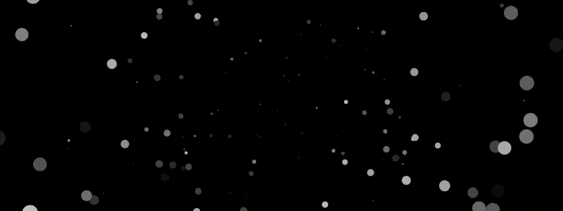
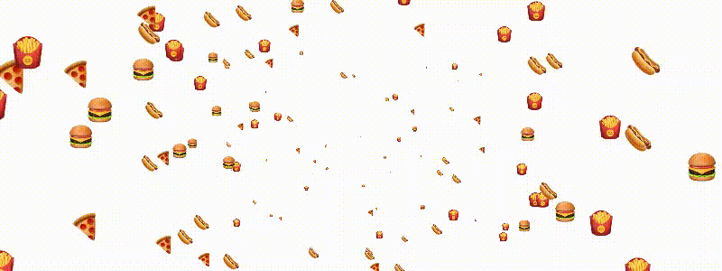

# particleQuest.js



# Setting Up

To get started, follow these steps to include the particleQuest JavaScript file and adjust the script to target an existing canvas element:

1. Include the particleQuest script in the header or footer of your HTML file, no other scripts are required:

```html
<script src="./particleQuest.min.js"></script>
```

2. Add a canvas element to your HTML:

```html
<canvas id="myCanvas" width="800" height="600"></canvas>
```

3. Adjust the script to initialize the particle animation on an existing canvas element:

```js
new particleQuest({
    canvasSelector: "#myCanvas",
    speed: 200,
    speedToEndDirection: 200,
    maxParticleSize: 200,
    textParticles: [🚀,🛸,🛰️],
});
```

Wait for the script to load with `window.onload` or `DOMContentLoaded`.

| Field                 | Description                                                                                                                                                                                                                                                          | Example of value                                        |
| :-------------------- | :------------------------------------------------------------------------------------------------------------------------------------------------------------------------------------------------------------------------------------------------------------------- | :------------------------------------------------------ |
| `canvasSelector`      | The selector for the canvas element can be targeted via class, like `.myCanvas`, or id, like `#myCanvas`. <br/> This is the only mandatory field                                                                                                                     | `"#myCanvas"`                                           |
| `speed`               | How fast the particle shrinks from X-size to 0.                                                                                                                                                                                                                      | `200`                                                   |
| `speedToEndDirection` | How long it will take for the particles reach the end direction.                                                                                                                                                                                                     | `100`                                                   |
| `textParticles`\*     | Use emojis, wrapped in an array with quotation marks as shown in the example. You can get emojis from <a href="https://getemoji.com/" target="_blank">GetEmoji</a>.                                                                                                  | `["🚀","🛸","🛰️"]`                                      |
| `urlImages`\*         | Instead of emojis, you can use images. Use the full URL or a relative path. Ensure they are in an array with quotation marks, as shown in the example. <br/>The images needs to be square.<br/>**NOTE:**<br/>You can only have either `textParticles` or `urlImages` | `["./assets/star.png", "https://my-url.com/star2.png"]` |
| `circleParticles`\*   | Set to true if you want the particles to be circles                                                                                                                                                                                                                  | `true`                                                  |
| `maxParticleSize`     | The maximum size of a particle.                                                                                                                                                                                                                                      | `200`                                                   |
| `fps`                 | If you think there are too many particles, you can use this to set a limit                                                                                                                                                                                           | `60`                                                    |

\* You can only have either `circleParticles`, `textParticles` or `urlImages`


